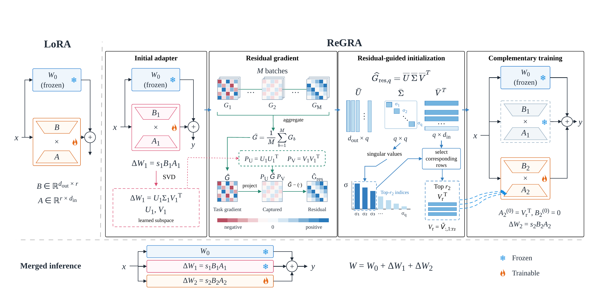

# ReGRA

ReGRA trains a second low-rank adapter in the residual gradient direction of a
first adapter. The implementation supports math, commonsense, code generation,
and GLUE classification or regression. Standard LoRA configs are included as
baselines.



[Open the main figure as a PDF](ReGRA.pdf).

## Method

For a target weight matrix, Stage 1 learns a LoRA update
`ΔW₁ = (α₁/r₁) B₁A₁`. ReGRA then:

1. Computes the left and right singular subspaces of `ΔW₁` and collects task
   gradients at the fixed model `W₀ + ΔW₁`.
2. Projects each calibration gradient with
   `G_res = G − (U₁U₁ᵀ) G (V₁V₁ᵀ)`, then aggregates rank-compressed gradients.
3. Sets the second adapter's `A₂` to the top right singular vectors of the
   residual gradient and initializes `B₂ = 0`.
4. Trains the second adapter on `W₀ + ΔW₁` with the task loss plus a normalized
   squared Frobenius inner-product penalty between `ΔW₁` and `ΔW₂`.

The Stage 2 task gradient is an ordinary LoRA training gradient. The residual
projection is used for initialization. Final evaluation composes
`W = W₀ + ΔW₁ + ΔW₂`.

## Environment and data

Run commands from this directory (`ReGRA-main`), because model and dataset paths
in the YAML files are relative to it. The current environment is
`../../env/Malora` (Python 3.10); its project dependencies are recorded in
[requirements.txt](requirements.txt). The configs expect the model directories
`../../meta-llama/Meta-Llama-3-8B` and `../../reberta-large`.

Local task data lives under `dataset/`:

| Task | Training data | Evaluation |
| --- | --- | --- |
| Math | `dataset/math/math_7k.json` | Six math test sets under `dataset/math/` |
| Commonsense | `dataset/commonsense/commonsense_170k.json` | Eight task test sets under `dataset/commonsense/` |
| Code | `dataset/code/CodeFeedback-Filtered-Instruction.jsonl` | EvalPlus MBPP+ base and enhanced tests |
| GLUE | Saved datasets under `dataset/GLUE/` | Labeled validation splits |

There are 12 configs each in `config/lora/` and `config/regra/`: `math.yaml`,
`commonsense.yaml`, `code.yaml`, and `glue-<task>.yaml` for CoLA, SST-2, MRPC,
STS-B, QQP, MNLI, QNLI, RTE, and WNLI. WNLI uses `nyu-mll/glue` because this
checkout has no local WNLI copy.

## Train and evaluate

Set the task by choosing a config file. For example, run both ReGRA stages for
code generation on GPU 0:

```bash
CUDA_VISIBLE_DEVICES=0 ../../env/Malora/bin/python train.py \
  -f config/regra/code.yaml --regra_config.stage=1 --evaluate=False
CUDA_VISIBLE_DEVICES=0 ../../env/Malora/bin/python train.py \
  -f config/regra/code.yaml --regra_config.stage=2
```

The same config and `output_dir` must be used for both stages. Stage 2 loads the
saved Stage 1 adapter automatically. With `evaluate: true` in the config, the
second command evaluates the merged model after training. `train.sh` runs this
sequence; pass another ReGRA config path as its first argument to change tasks.

Run the standard LoRA baseline with a matching task config:

```bash
CUDA_VISIBLE_DEVICES=0 ../../env/Malora/bin/python train.py -f config/lora/code.yaml
```

To evaluate already saved ReGRA adapters without training:

```bash
CUDA_VISIBLE_DEVICES=0 ../../env/Malora/bin/python train.py \
  -f config/regra/code.yaml --regra_config.stage=2 \
  --finetune=False --evaluate=True
```

The YAML files control LoRA rank and targets, training hyperparameters, DNS
calibration batches, and the Stage 2 orthogonality weight. Commonsense DNS
calibration samples randomly without replacement from the mixed training file,
using the configured seed.

## Outputs

Each config sets its own `output_dir`, for example `./log/regra/code`.

| Run | Saved artifact |
| --- | --- |
| ReGRA Stage 1 | `output_dir/stage1/` adapter |
| ReGRA Stage 2 | `output_dir/stage2/` adapter |
| ReGRA merged evaluation | `output_dir/fused/w0_stage1_stage2/evaluated_result/` |
| Standard LoRA | `output_dir/finetuned_result/` adapter and `output_dir/evaluated_result/` |

Code evaluation writes `mbpp/summary.json` inside the evaluation directory,
with Pass@1 on the same MBPP+ problems under base and enhanced tests. GLUE
writes `glue_results.json`; math and commonsense write per-dataset results and
an `accuracy.json` summary.
